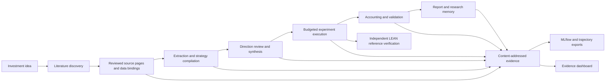

# FactorForge

**Quantitative research agents with inspectable evidence.**

FactorForge connects investment ideas, literature, typed factor hypotheses, hybrid
strategies and backtests in a resumable research workflow. It keeps model proposals,
deterministic execution rules and the evidence behind each decision separately
inspectable, so an experiment can be reviewed or replayed without repeating inference.

[Open the free Hugging Face demo](https://huggingface.co/spaces/chinmayarvind/factorforge)
| [Run research locally](docs/research-command.md)
| [Architecture](docs/system-design.md)
| [Historical study report](reports/historical-study-v1.json)


The recording shows four saved, originally authored scenarios. The hosted dashboard
verifies downloaded evidence in the browser; new model-driven research runs locally.
[Download the demo video](docs/assets/demo.mp4).

## What is implemented

- **Literature to source evidence:** Crossref discovery, reviewed local PDF admission,
  physical-page provenance and deterministic source selection.
- **Research workflow:** typed extraction, strategy compilation, independent direction
  review, bounded revision, model-proposed synthesis and compatible weighted hybrids.
- **Execution and validation:** point-in-time checks, signed-share accounting, explicit
  transaction costs, retained return paths, walk-forward/purged splits and HAC diagnostics.
- **Observed-data admission:** archived raw sources, transformation and timing evidence,
  rights checks and PostgreSQL readback of complete dataset provenance.
- **Independent verification:** a resource-limited LEAN execution of an authored reference
  strategy, with actual orders, fills, fees and portfolio valuations.
- **Memory and observability:** PostgreSQL checkpoints, searchable retained outcomes,
  content-addressed lineage, trajectory exports, local OpenTelemetry and MLflow tracking.

## Verified engineering results

| Check | Recorded result | Evidence |
|---|---|---|
| Independent LEAN reference execution | 13 portfolio valuations and 4 fills, including fees, match the reference | [Comparison](data/verification/lean-execution-v1/comparison.json) |
| MLflow evidence projection | 64 objects read back and verified; serial replay reuses the run | [Tracking integration](tools/tracking/README.md) |
| Hosted evidence dashboard | 4 saved execution/research scenarios with browser hash checks | [Demo](https://huggingface.co/spaces/chinmayarvind/factorforge) |
| Hybrid strategy compiler | Supports 2 to 4 compatible source strategies with explicit weights | [Hybrid research](docs/hybrid-research.md) |
| Retrospective fixed-universe study | 45 retrospective signal/cost experiments; 15 signals, 3 cost settings; 30,192 observations; 7,516 backtest spans | [Saved report](reports/historical-study-v1.json) |

These results describe specific engineering/reference cases. Published-factor reproduction,
full FactorSpec accuracy and the 45-case autonomous release benchmark are separate research
measurements. Development extraction comparisons and their full denominators remain in
[extraction evaluation](docs/extraction-comparison.md); chronological engineering evidence
remains in [results](docs/results.md).

## Run the evidence dashboard

Python 3.12+, uv and a browser are sufficient for the saved-evidence demo:

```powershell
uv sync --locked
uv run python scripts/build_space.py
uv run python scripts/build_historical_report.py --input reports/historical-study-v1.json --output dist/space/historical-study.html
uv run python -m http.server 8766 --bind 127.0.0.1 --directory dist/space
```

Open `http://127.0.0.1:8766`. The builder uses original repository fixtures and verifies
the artifact closure. This path makes no model calls and needs no database or cloud account.

## Run research

The local research path also needs PostgreSQL and the named Ollama models. Set `RDS_DSN`
in the operator environment, then prepare an original example and preserve its request:

```powershell
uv run python infra/research/prepare_original.py --artifacts artifacts/research-original --request artifacts/research-original/request.json
uv run factorforge-research --request artifacts/research-original/request.json --artifacts artifacts/research-original --workflow
```

See the [operator guide](docs/research-command.md) for model setup, budgets, replay and
memory queries. Use [discovery](docs/literature-discovery.md) and
[PDF admission](docs/source-ingestion.md) for permitted papers, or the
[source-to-hybrid command](docs/source-synthesis.md) for reviewed multi-paper inputs.
The pipeline retains model observations and explicit terminal decisions as produced.

## How it fits together



LangGraph and PostgreSQL retain workflow state and operation receipts. Deterministic
Python/Polars code owns accounting and validation. Model output proposes research
content; it does not change authorization, data timing, execution policy or budgets.

## Stack and remaining work

The implemented core uses **Python, LangGraph, Polars, PostgreSQL, Ollama, Docker,
LEAN, OpenTelemetry and MLflow**, with a free static **Hugging Face** deployment.
AWS adapters/configuration exist for S3/Cognito; [optional AWS operator setup](docs/deployment.md)
is documented separately. Kubernetes/EKS is an optional architecture extension.

[LangSmith trace imports](tools/tracking/LANGSMITH.md) are SDK/HTTP-contract tested;
hosted account verification remains. The [Neo4j projection](tools/tracking/NEO4J.md)
has verified real-server import, replay, reverse lookup and conflict rollback.
[DVC tooling](tools/dvc/README.md) retains its dependency-audit gate.
[Deep Agents planning](tools/planning/README.md) has a bounded local model adapter,
PostgreSQL step replay and verified proposal/trajectory output.
[PyTorch/TRL training](tools/training/README.md) implements local LoRA SFT and DPO from
explicitly reviewed development trajectories, with source verification and candidate
receipts. Training execution and policy improvement remain unmeasured; the full
published-factor and autonomous research benchmarks remain separate research work.

The next research improvements are dependable source extraction, broader point-in-time
historical data support, frozen end-to-end evaluation, and measured runtime/cost studies.
Large-scale distributed processing and AWS infrastructure follow those requirements.

## Further documentation

[Validation](docs/research-validation.md) | [Sandbox](docs/sandbox.md) |
[LEAN](infra/lean/execution/README.md) | [Trajectories](docs/research-trajectories.md) |
[Deployment](docs/deployment.md) | [Security](docs/security.md) |
[Methodology](docs/quant-methodology.md) | [Architecture decisions](docs/adr/)
