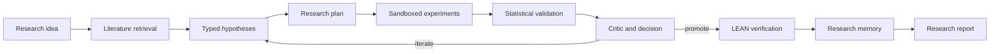

# FactorForge

**Autonomous quantitative research with reproducible evidence**

Implementation status: a trusted local command now connects a research idea to ranked
source packets, durable model extraction, source-derived strategy drafts, monthly
experiments and retained HAC diagnostics. PostgreSQL stores run budgets, operation
results and LangGraph experiment checkpoints. Version-two plans add a separate,
source-cited direction review before experiment dispatch. Prompts, observations,
input references, results and review decisions remain available for replay. See the
[research command](docs/research-command.md) and [direction review](docs/direction-review.md).

The monthly engine currently executes the original integration fixture using verified
point-in-time inputs, declared formation/trade timing, exact funding and transaction
costs. Walk-forward/purged splitters have boundary tests and HAC calculations have
independent statsmodels reference checks;
full statistical research decisions and published-factor reproduction remain to be
composed and evaluated. The frozen three-paper extraction pilot matched 11 of 27
critical fields; release FactorSpec accuracy remains unmeasured.

A Docker sandbox stages verified artifacts and retains execution, termination and
cleanup evidence. Eight original acceptance cases pass locally and in hosted CI.
A separate real LEAN integration spike verifies an original seeded NAV path; full
strategy translation and independent factor verification remain in progress. See
[sandbox setup](docs/sandbox.md) and [results](docs/results.md).

The browser/API supports research briefs and owner-scoped run inspection. Cognito
access-token verification is implemented; live sign-in and cloud deployment remain
planned. The broader research loop and architecture below describe the target system.
Release benchmark metrics are unmeasured. Use the [commands](docs/commands.md) and
linked component documentation for the implemented command surface.

FactorForge turns a loose investment idea into a structured, reviewable research program. It retrieves relevant literature, extracts and proposes typed factor hypotheses, runs bounded experiments in sandboxes, validates strategies with time-series-aware statistics, independently verifies selected results in LEAN, records the full experiment lineage, and produces a research report that explains what worked, what failed, and why.

FactorForge is a research system. It does not place live trades or move capital.

## Core research loop



LangGraph owns the durable state machine, budgets, stop conditions, retries, checkpoints, and legal transitions. Deep Agents handles bounded long-horizon work such as literature synthesis, hypothesis refinement, and critique. Deterministic code owns point-in-time rules, statistics, portfolio accounting, sandbox policy, and lineage validation.

## Architecture at a glance

```text
Browser on Vercel
        |
TypeScript + Bun
        |
       REST
        |
FastAPI control plane
        |
        +--> Cognito identity
        +--> LangGraph research state machine
        |       +--> Deep Agents bounded research workers
        |       +--> MCP tool adapters
        |       +--> checkpoint, permission, and budget gates
        |
        +--> RDS PostgreSQL: durable run state and lineage index
        +--> S3 + DVC: datasets, generated code, results, reports
        +--> Redis: ephemeral state, cache, rate limits, locks
        +--> Elasticsearch: literature and experiment search
        +--> Neo4j: derived research relationship graph
        +--> MLflow: experiments, registry, promotion metadata
        |
        +--> SQS: durable experiment jobs
                |
                v
        sandbox worker plane
        Docker locally, EKS Jobs in the cloud
                |
                +--> Polars fast research engine
                +--> PySpark offline scale path
                +--> LEAN verification over internal gRPC
                +--> R statistical cross-checks
                +--> RL environment + PyTorch / TRL trajectory learning and RLVR lab

Observability:
LangSmith + OpenTelemetry + Prometheus/Grafana + CloudWatch
```

The API workload is small compared with the research workload. The planned Kubernetes deployment runs isolated, parallel, resource-bounded experiment jobs on EKS. Current execution is local; EKS infrastructure and Kubernetes manifests are not yet implemented.

## Key features

- Natural-language idea to typed `FactorSpec`
- Literature retrieval with lexical, dense, and citation-graph signals
- Explicit plan, execute, verify research loop
- Point-in-time data contracts that make lookahead leakage testable
- Fast vectorized factor experiments with Polars
- Walk-forward and purged cross-validation with embargo
- Transaction-cost, turnover, drawdown, Sharpe, Sortino, IC, and HAC t-stat analysis
- Independent LEAN verification for promoted strategies
- Sandboxed generated code with no live-trading permissions
- Research memory across successful and failed experiments
- Reproducible lineage across prompts, data, code, configs, seeds, traces, and results
- Outcome and execution-path evaluation kept as separate scorecards
- LangSmith and OpenTelemetry traces for agent decisions, tools, latency, and cost
- MCP tool interoperability and an A2A cross-framework interoperability path
- Offline PyTorch/TRL learning from verified research trajectories
- RL environment with typed states/actions, verifiable rewards, RLVR, and benchmarked multi-step agentic RL

## Research pipeline canon

The research lifecycle explicitly implements the nine-stage autonomous-research sequence:

```text
Evaluation Harness
Hypothesis Generator
Literature Retrieval
Experiment Runner
Result Evaluator
Paper Writer
Critic Loop
Iteration Scheduler
End-to-End Research Demo
```

See [docs/research-pipeline.md](docs/research-pipeline.md).

The post-MVP learning path adds a versioned research environment, successful and failed trajectory datasets, preference learning, RLVR with deterministic/reference-based rewards, and multi-step agentic RL. The learned policy remains inside the same hard harness boundaries. See [docs/agentic-rl.md](docs/agentic-rl.md).

Documentation

- [Product requirements](PRD.md)
- [System design](docs/system-design.md)
- [High-level design](docs/HLD.md)
- [Low-level design](docs/LLD.md)
- [Architecture alternatives](docs/architecture-alternatives.md)
- [API contracts](docs/api-contracts.md)
- [Data model and lineage](docs/data-and-lineage.md)
- [Quant methodology](docs/quant-methodology.md)
- [Research pipeline](docs/research-pipeline.md)
- [Agentic RL and RLVR](docs/agentic-rl.md)
- [Agent harness](docs/harness.md)
- [Research memory and failed-experiment ledger](docs/research-memory.md)
- [Evaluation methodology](docs/evaluation.md)
- [Benchmark methodology](docs/benchmark-methodology.md)
- [Security](docs/security.md)
- [Threat model](docs/threat-model.md)
- [Observability](docs/observability.md)
- [Performance and scalability](docs/performance.md)
- [Failure modes](docs/failure-modes.md)
- [Deployment](docs/deployment.md)
- [Interoperability](docs/interoperability.md)
- [Reproducibility](docs/reproducibility.md)
- [Quality gates](docs/quality-gates.md)
- [Results](docs/results.md)
- [Demo plan](docs/demo.md)
- [Technical blog outline](docs/blog-outline.md)
- [Commands](docs/commands.md)
- [References](docs/references.md)
- [Architecture decision records](docs/adr/)

## Repository shape

```text
apps/
  api/
  web/
src/factorforge/
  api/
  auth/
  domain/
  orchestration/
  agents/
  tools/
  retrieval/
  data/
  factors/
  backtests/
  validation/
  memory/
  lineage/
  sandbox/
  telemetry/
  interop/
tests/
evals/
benchmarks/
data/
research/
artifacts/
infra/
monitoring/
scripts/
docs/
```

The tree grows as components are implemented. Stable module boundaries are planned up front, but a directory does not justify creating unused abstractions.

## First useful path

Local development starts with the smallest end-to-end research loop:

```text
idea -> typed hypothesis -> tiny fixture dataset -> Polars backtest
     -> deterministic validation -> research verdict -> report
```

Cloud infrastructure, distributed workers, additional search systems, A2A, RL environments, RLVR, agentic RL, and large-scale data paths are added after this loop is correct and measurable.

See [docs/commands.md](docs/commands.md) for the intended command surface.
