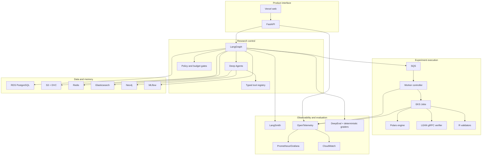
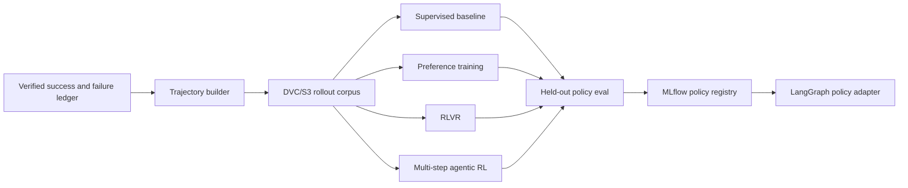

# FactorForge High-Level Design

Current implementation: a Next.js browser console and one local FastAPI process with opt-in development identity and a
bounded in-memory run store. It creates receipts and normalizes brief text only. PostgreSQL,
agent research, isolated execution and the cloud planes below remain planned. This local
slice establishes the HTTP/event contract before durability is added.
The browser performs bounded polling and validates responses before rendering progress.

## Logical planes

FactorForge contains five logical planes:

1. product interface,
2. research control,
3. experiment execution,
4. data and memory,
5. observability and evaluation.

They are logical boundaries first. Deployable service boundaries appear only where isolation or scaling requires them.

## Major responsibilities

### FastAPI

Owns external contracts, auth-derived identity, request validation, status streaming, and user-facing errors.

### LangGraph

Owns legal state transitions, checkpoints, budgets, retries, conditional routing, and run termination.

### Deep Agents

Owns bounded long-horizon research work that benefits from subagents, skills, filesystem-backed context, and compact handoffs.

### Experiment worker plane

Owns generated-code execution. It is the only place arbitrary experiment code is allowed to run.

### RDS

Owns durable application state and lineage pointers.

### S3/DVC

Owns large immutable artifacts and dataset snapshots.

### MLflow

Owns experiment comparison, metrics, artifact pointers, and promotion metadata for learned components and factor candidates.

### Neo4j

Owns derived relationship traversal for research memory.

### Elasticsearch

Owns hybrid search across literature and research text.

### LangSmith and OTel

LangSmith explains AI trajectories. OTel explains distributed-system behavior. Both use the same run/trace correlation identifiers.

## Deployment progression

The first useful version can run with one FastAPI process, local Postgres, Docker, and small fixture datasets. Productionization adds managed state and the EKS worker plane without changing research domain contracts.

## Explicit boundary

There is no live trading service in this architecture.

## Learning plane

The LangGraph control plane retains lifecycle authority after a learned policy is deployed.
