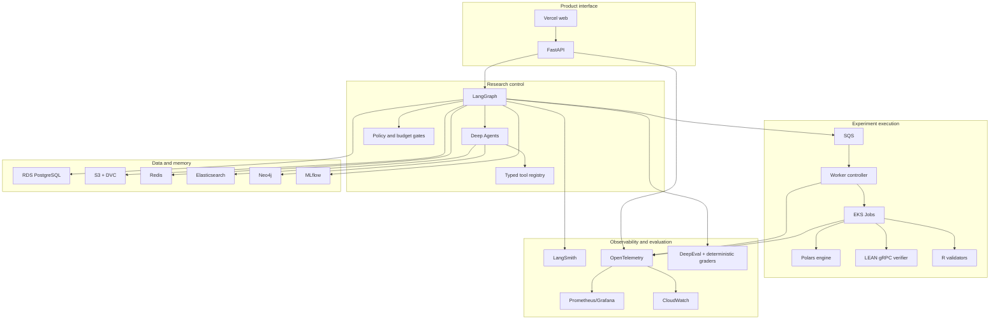
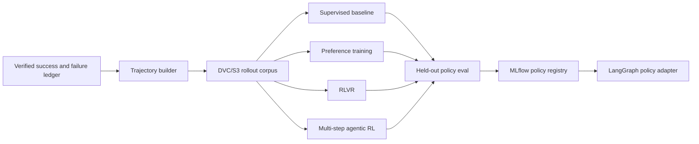

# FactorForge High-Level Design

Current implementation: a Next.js browser console and one FastAPI process with explicit local
identity or verified Cognito access tokens. Storage is independently configured as bounded
memory or PostgreSQL with actual LangGraph checkpoints. It creates owner-scoped receipts and
normalizes brief text in the browser/API flow. The full agent research loop and cloud deployment remain planned.
Live Cognito integration and browser sign-in still need deployment configuration.
The browser performs bounded polling and validates responses before rendering progress.
PostgreSQL holds accepted state; LangGraph checkpoints execution progress. Their commits are
separate. Recovery validates a durable checkpoint before publishing its accepted transition.
The pure normalization step can safely repeat; this is not an exactly-once execution claim.

A trusted worker path now composes canonical-idea retrieval, durable source extraction,
reviewed strategy compilation and automatic monthly experiment scheduling. Model operations
reserve budget before dispatch and retain their outcomes. Each compiled experiment uses a
persisted two-node LangGraph for execution and publication. Retry reuses settled operations;
the source/compilation stages currently recompute deterministic work. The worker publishes
the source evidence, draft decisions and ordered execution results. This path requires the
explicit execute_research capability and original-fixture data; it does not expand browser
permissions. Validation, research iteration and the enclosing research graph remain planned.

The data foundation adds immutable content stores, a dataset catalog within the same PostgreSQL
boundary and deterministic point-in-time selection. Catalog publication verifies input bytes
and permitted uses before committing metadata. Large objects stay outside PostgreSQL; their
SHA-256 references bind source and policy metadata. The local store and S3 request contracts
are tested; live AWS storage verification and empirical data coverage remain pending.

The literature development path now runs an in-process BM25 baseline over versioned documents
and records a frozen pilot's per-query results. A separate one-shot local model adapter archives
source packets, prompts, delivery and extraction outcomes. This path has no tools or authority
to execute paper instructions. It is not yet connected to the API's durable research loop.
The [results](results.md) distinguish development retrieval and critical-field extraction pilots
from unmeasured release accuracy and factor replication. Elasticsearch and dense retrieval remain
planned comparisons under ADR-006.

Strict factor contracts and a deterministic hypothesis queue now check declared strategy
choices and artifact readiness. Drafts with unresolved questions remain blocked; exact duplicate
execution contracts remain visible without entering the queue twice. These in-process checks
do not yet execute a portfolio. The [factor contract](factor-contract.md) defines their scope.

## Logical planes

FactorForge contains five logical planes:

1. product interface,
2. research control,
3. experiment execution,
4. data and memory,
5. observability and evaluation.

They are logical boundaries first. Deployable service boundaries appear only where isolation or scaling requires them.

## Major responsibilities

### FastAPI

Owns external contracts, auth-derived identity, request validation, status streaming, and user-facing errors.

### LangGraph

Owns legal state transitions, checkpoints, budgets, retries, conditional routing, and run termination.

### Deep Agents

Owns bounded long-horizon research work that benefits from subagents, skills, filesystem-backed context, and compact handoffs.

### Experiment worker plane

Owns generated-code execution. It is the only place arbitrary experiment code is allowed to run.

### RDS

Owns durable application state and lineage pointers.

### S3/DVC

Owns large immutable artifacts and dataset snapshots.

### MLflow

Owns experiment comparison, metrics, artifact pointers, and promotion metadata for learned components and factor candidates.

### Neo4j

Owns derived relationship traversal for research memory.

### Elasticsearch

Owns hybrid search across literature and research text.

### LangSmith and OTel

LangSmith explains AI trajectories. OTel explains distributed-system behavior. Both use the same run/trace correlation identifiers.

## Deployment progression

The first useful version can run with one FastAPI process, local Postgres, Docker, and small fixture datasets. Productionization adds managed state and the EKS worker plane without changing research domain contracts.

## Explicit boundary

There is no live trading service in this architecture.

## Learning plane

The LangGraph control plane retains lifecycle authority after a learned policy is deployed.

The implemented local learning entry point is [reviewed SFT/DPO training](../tools/training/README.md).
It reconstructs retained development trajectories, prepares explicit review labels and
saves a candidate LoRA adapter. Registry promotion, RLVR and multi-step agentic RL in
the diagram remain future stages. No training improvement is asserted by this implementation.

The monthly execution engine supports opt-in corporate actions through independent
rational balances reconciled against Decimal ledger replay. Pending cash claims contribute
to NAV while settlement controls spendable cash. See [the decision](adr/monthly-corporate-actions.md).

Optional service paths now include GraphQL/MCP over a shared public evidence catalog,
Elasticsearch over verified literature captures, Kafka over admitted archived quotes,
and Grafana/Prometheus over retained evidence gauges. These run outside the static Space
and keep the existing research scheduler unchanged. See [service boundaries](optional-services.md).
