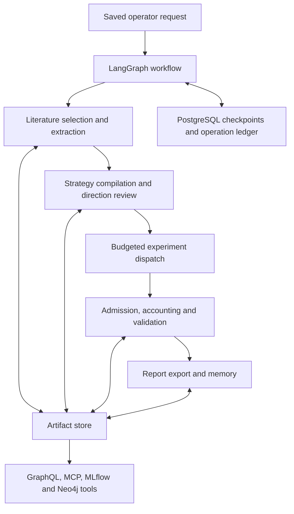

# Architecture

FactorForge is a modular Python research system with separate operator tools for
inspection, tracking and transport. The workflow retains each decision and the source
objects needed to explain it.

## Control and execution

[Orchestration](../src/factorforge/orchestration/) owns request identity, budget
reservation, operation receipts and checkpoints. A retained receipt lets a resumed
workflow recover a completed operation without repeating provider work. Uncertain
external operations require reconciliation before retry.

[Retrieval](../src/factorforge/retrieval/) selects reviewed source pages and produces
structured observations. [Strategy compilation](../src/factorforge/factors/) applies
explicit data bindings, timing and allocation rules. Source text is input data, never
execution authority.

[Backtests](../src/factorforge/backtests/) use declared calendars and known-at timestamps.
The monthly loop reconciles its account with the ledger and stages trade batches before
commit. Pending receivables enter account value when earned and spendable cash when paid;
liabilities reserve cash. Explicit policy declarations govern event handling and sizing.

## Storage and derived views

The artifact store identifies immutable objects by content. PostgreSQL retains durable
workflow state. MLflow and Neo4j provide inspection projections; the source artifact
closure remains the basis for replay. Optional query services read operator-selected
saved material through bounded interfaces.

## Service boundaries

Elasticsearch indexes verified literature metadata. Redis caches expiring discovery
locators. Kafka transports admitted archived quote events and journals consumed messages
before acknowledging offsets. GraphQL and MCP expose read-only views. Prometheus and
Grafana distinguish retained gauges from current scrape health.

Each service has a focused boundary and separate setup. This keeps the local research
path usable without requiring the entire service collection to run.

## Tradeoffs

Strict schemas and explicit source admission require preparation, but make unsupported
inputs fail visibly rather than changing their meaning. Exact arithmetic and deterministic
execution simplify reconciliation while imposing representability constraints. Full ledger
replay is used for action-bearing accounts; action-free accounts can reuse derived state.

The static demo is inexpensive to host and easy to inspect. Research execution stays on
an operator-controlled machine with access to its database, model and artifact storage.
