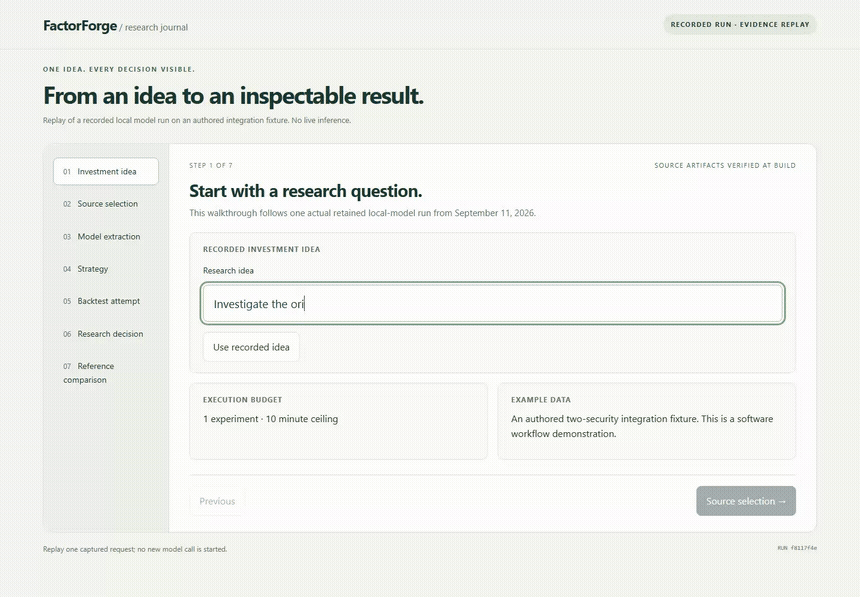

# Demo

[Watch the recording](assets/research-journey.mp4) ·
[Open the interactive journey](https://chinmayarvind-factorforge.static.hf.space/journey.html)



The recording follows a saved local-model run from its idea through reviewed source
selection, structured extraction, compilation and an execution decision. It uses authored
integration inputs and preserves the recorded interpretation. The final reference
comparison is separately authored rather than an automatic correction by the agent.

The media is retained as recorded. The [dashboard tour](assets/demo.mp4) provides a second
view of the application. New model-driven work uses the [research operator](research.md).

## Record a journey

Supply a retained original capture and an existing reference-demo artifact store:

```powershell
uv run python scripts/build_journey.py --run PATH_TO_CAPTURE --reference-demo dist/space --output artifacts/demo/journey.json
uv run python scripts/build_space.py --journey artifacts/demo/journey.json
uv run python -m http.server 8769 --bind 127.0.0.1 --directory dist/space
```

After installing the browser workspace and Playwright Chromium, set a fresh recording
folder and run the recorder from the repository root:

```powershell
$env:FACTORFORGE_DEMO_URL='http://127.0.0.1:8769/journey.html'
$env:FACTORFORGE_DEMO_RECORDING='C:/path/to/fresh-recording-directory'
node apps/web/scripts/record-journey.mjs
```

The recorder produces a WebM, screenshots and a receipt. Preserve the original alongside
any MP4/GIF exports. Its assertions describe the recorded example; update them explicitly
when recording a different capture. No provider calls are made by the recorder itself.
