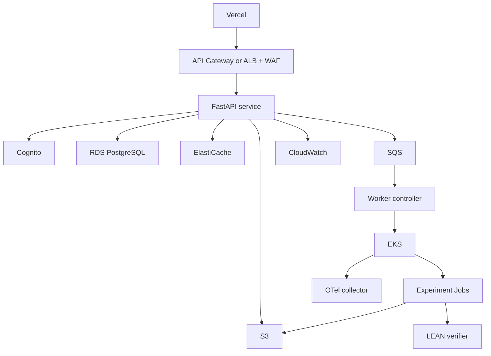

# Deployment

## Current delivery: free Hugging Face Space

The public demo serves saved executions from the existing Python monthly engine.
It includes a completed original synthetic experiment and a precision guard, with
portfolio observations, trades and downloadable result evidence. The build verifies
the full reachable artifact closure; the browser checks result SHA-256 and byte size.
Visitors run new research locally through the [research command](research-command.md).

```powershell
uv sync --locked
uv run python scripts/build_space.py
uv run python -m http.server 8766 --bind 127.0.0.1 --directory dist/space
```

Open `http://127.0.0.1:8766`. Publish only the reviewed `dist/space` directory:

```powershell
uv tool run --from huggingface_hub hf auth login
uv tool run --from huggingface_hub hf repos create YOUR_ACCOUNT/factorforge --type space --sdk static --public
uv tool run --from huggingface_hub hf upload YOUR_ACCOUNT/factorforge dist/space --type space
```

Use a dedicated output directory. The build inputs are original synthetic data and
public source snapshots. Do not add private research, tokens, or workspace files.
No paid inference endpoint, hardware upgrade, or storage volume is required.

[Static Spaces](https://huggingface.co/docs/hub/spaces-sdks-static) are free for everyone.
The current [Spaces overview](https://huggingface.co/docs/hub/spaces-overview) requires a
paid plan to create Docker Spaces. Static hosting displays saved evidence and does
not run the Python backend or perform live inference.

## Optional AWS operator setup

AWS provisioning and EKS implementation are outside the current delivery path.
The stages below describe optional architecture, not deployed or fully implemented
infrastructure. To host the existing components yourself:

1. Verify a local research run, PostgreSQL migrations and saved report using the
   [research command](research-command.md).
2. Provision private PostgreSQL accessible only to the application and operator worker.
   Supply the DSN through a protected environment or secret manager.
3. Configure Cognito using `src/factorforge/api/settings.py`: region, pool, client,
   approved browser origin and Cognito identity mode. Local mode remains loopback-only.
4. Host `uvicorn factorforge.api.app:app` behind HTTPS on your EC2/container service.
   Verify `/health`, `/ready`, authenticated creation and owner-scoped inspection.
5. Run research commands on an operator-controlled host with PostgreSQL connectivity,
   Ollama and persistent local artifact storage. Back up database and artifacts together.
   A bucket alone does not replace the current local artifact store.
6. Follow [sandbox prerequisites](sandbox.md) on the worker host, with no publicly
   accessible Docker socket. EKS/SQS execution needs a separately implemented adapter.
7. Restrict ingress and IAM, set AWS budgets, and verify restore and rollback before
   offering multi-user access. Retain the previous code revision and locked environment.

The free demo build creates no AWS resources.

## Stage 1: local

```text
Bun/Next.js
FastAPI
PostgreSQL
Redis
Elasticsearch
Neo4j
MLflow
Docker sandbox
```

Only services needed by the current implementation should be started.

## Stage 2: low-cost staging

- Vercel frontend
- FastAPI on a small AWS service/EC2
- managed RDS
- S3
- Cognito
- single-node supporting stores where acceptable

Lightsail can be used as a cost/operations comparison for simple staging. It is not the final worker architecture.

## Stage 3: production-shaped AWS



## Terraform

Terraform manages VPC/networking, IAM, Cognito, RDS, S3, SQS, ElastiCache, ECR, EKS, EC2 node groups, CloudWatch resources, security groups, and KMS resources where used.

## Kubernetes

Kubernetes resources include worker controller Deployment, experiment Job template, LEAN verifier Deployment/Service, OTel collector, NetworkPolicies, resource quotas, service accounts, pod security settings, and HPA where a continuously running service benefits.

Each experiment Job sets:

```text
activeDeadlineSeconds
backoffLimit
ttlSecondsAfterFinished
resources.requests
resources.limits
run-scoped service account
restricted securityContext
```

## CI/CD

Pull request:

- format/lint,
- strict types,
- unit/integration tests,
- security scans,
- small eval smoke,
- Docker build,
- Terraform validate.

Run:

- full benchmark gate,
- image push to ECR,
- Terraform plan review,
- staging deployment,
- smoke/failure tests,
- controlled promotion.

## Rollback

Application images are immutable, config versions are explicit, database migrations are backward-aware, worker image digest is stored in lineage, and the previous deployment revision remains available.

## Supabase

Supabase is allowed only for sanitized public demo feedback or anonymous demo annotations if that feature is retained. It does not store licensed research data or canonical run state.

## Vercel

Vercel hosts the web UI. Backend secrets and research permissions remain server-side.
