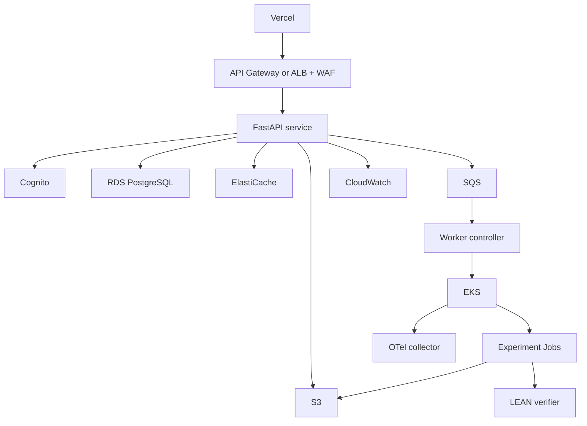

# Deployment

## Stage 1: local

```text
Bun/Next.js
FastAPI
PostgreSQL
Redis
Elasticsearch
Neo4j
MLflow
Docker sandbox
```

Only services needed by the current implementation should be started.

## Stage 2: low-cost staging

- Vercel frontend
- FastAPI on a small AWS service/EC2
- managed RDS
- S3
- Cognito
- single-node supporting stores where acceptable

Lightsail can be used as a cost/operations comparison for simple staging. It is not the final worker architecture.

## Stage 3: production-shaped AWS



## Terraform

Terraform manages VPC/networking, IAM, Cognito, RDS, S3, SQS, ElastiCache, ECR, EKS, EC2 node groups, CloudWatch resources, security groups, and KMS resources where used.

## Kubernetes

Kubernetes resources include worker controller Deployment, experiment Job template, LEAN verifier Deployment/Service, OTel collector, NetworkPolicies, resource quotas, service accounts, pod security settings, and HPA where a continuously running service benefits.

Each experiment Job sets:

```text
activeDeadlineSeconds
backoffLimit
ttlSecondsAfterFinished
resources.requests
resources.limits
run-scoped service account
restricted securityContext
```

## CI/CD

Pull request:

- format/lint,
- strict types,
- unit/integration tests,
- security scans,
- small eval smoke,
- Docker build,
- Terraform validate.

Run:

- full benchmark gate,
- image push to ECR,
- Terraform plan review,
- staging deployment,
- smoke/failure tests,
- controlled promotion.

## Rollback

Application images are immutable, config versions are explicit, database migrations are backward-aware, worker image digest is stored in lineage, and the previous deployment revision remains available.

## Supabase

Supabase is allowed only for sanitized public demo feedback or anonymous demo annotations if that feature is retained. It does not store licensed research data or canonical run state.

## Vercel

Vercel hosts the web UI. Backend secrets and research permissions remain server-side.
