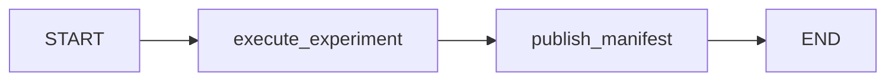

# Persisted monthly experiment subgraph

`MonthlyExperimentGraph` composes the existing monthly worker into a real LangGraph:

It accepts a trusted owner, canonical run UUID and immutable `MonthlyRequest`.
The state retains the complete canonical command, owner issuer/subject, run ID,
graph version, full result JSON and published result hash. Large source tables
remain in the artifact store and are bound through the result's source references.
The published manifest is the existing `MonthlyRun` evidence closure, not a complete
literature-to-report research manifest.

The subgraph reuses the application's PostgreSQL saver with synchronous checkpoint
durability and disabled pickle fallback. A derived thread UUID separates each run
and request from the earlier normalization graph. A transaction-scoped PostgreSQL
advisory lock serializes writers to that graph thread. The canonical run's owner is
checked before checkpoint access; a checkpoint cannot supply execution authority.

The execution node uses the durable experiment reservation and settlement boundary.
If execution settled before its graph checkpoint persisted, replay recovers that result.
The publication node verifies the checkpoint's result against a read-only recovery of
the canonical settlement, then publishes the retained `MonthlyRun` artifact identity.
Final verification follows the same read-only recovery path and cannot reserve new work.

An unresolved reservation requires explicit reconciliation. A changed owner/request,
altered result, or missing settlement cannot pass checkpoint acceptance. Node errors
remain in LangGraph's persisted task state, allowing investigation and controlled resume.
The trusted monthly executor is bounded by its source/profile limits; this subgraph
does not add process isolation or a hard process deadline.

This is the experiment component for the larger research graph. Literature retrieval,
extraction, hypothesis synthesis, statistical validation, verdict and report stages
will compose around it. The browser's normalization flow remains separately versioned.
