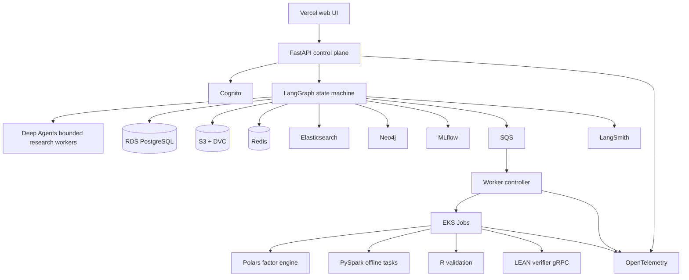

# FactorForge System Design

## 1. Restated problem

Design an autonomous quantitative-research system that can take an imprecise investment idea, convert it into testable factor hypotheses, retrieve relevant literature, execute isolated research code, validate results using finance-appropriate statistics, decide what to try next, and preserve enough evidence to reproduce every conclusion.

The system automates research work without automating live trading.

## 2. Functional requirements

The system must:

- accept a research idea,
- retrieve papers and prior experiments,
- generate typed hypotheses,
- build an executable factor specification,
- acquire a pinned dataset snapshot,
- run sandboxed backtests,
- validate temporal correctness,
- model transaction costs,
- perform walk-forward and purged validation,
- run statistical robustness checks,
- independently verify promoted strategies in LEAN,
- iterate under hard budgets,
- checkpoint and resume,
- preserve successful and failed trajectories,
- expose a reviewable report and evidence bundle.

## 3. Non-functional requirements

The architecture is constrained by:

- reproducibility,
- data lineage,
- deterministic safety gates,
- isolated code execution,
- long-running task recovery,
- bounded cost,
- observability across model/tool/worker boundaries,
- small interactive API traffic,
- bursty experiment compute,
- a requirement to demonstrate production infrastructure without letting infrastructure block the first useful version.

## 4. Capacity assumptions

Initial portfolio workload:

```text
registered researchers             20
simultaneously active researchers   5
research runs per day              10
interactive API requests per run   20 to 50
parallel experiment slots per run   3 to 6
cloud experiment concurrency       12 to 24
typical run duration                15 to 60 min
artifact volume per run             10 to 250 MB
```

The interactive web API is not the scaling problem. Experiment workers are.

This distinction drives the architecture. A small stateless FastAPI control plane is sufficient while compute-heavy experiments use a separately scalable worker plane.

## 5. Architecture alternatives

### Alternative A: one giant autonomous agent

```text
idea
  |
one Deep Agent with literature, code, data, backtest,
statistics, memory, report, and cloud tools
  |
final answer
```

Advantages:

- fast demo,
- little orchestration code,
- flexible model behavior.

Problems:

- control flow lives in model behavior,
- tool surface grows quickly,
- context becomes a transcript instead of structured state,
- stop conditions become hard to audit,
- failures are difficult to attribute,
- a plausible final report can hide a bad execution path,
- replay and deterministic validation are weak.

Use this only for a disposable prototype.

### Alternative B: microservices and Kubernetes from the first commit

```text
API service
planner service
literature service
backtest service
stats service
memory service
report service
event bus
Kubernetes everywhere
```

Advantages:

- independent scaling,
- clear deployable ownership boundaries,
- strong infrastructure learning.

Problems:

- network and deployment failures appear before research correctness exists,
- local debugging is slow,
- each boundary needs auth, retries, tracing, schemas, and versioning,
- the first user does not need service-level scaling,
- engineering time goes to coordination instead of quant methodology.

This becomes reasonable only when components have materially different runtime or scaling properties.

### Alternative C: notebook plus autonomous edit-and-run loop

```text
idea -> notebook/program -> model edits -> run -> keep/revert -> repeat
```

Advantages:

- excellent research iteration speed,
- minimal surface area,
- easy to inspect diffs,
- close to the autoresearch philosophy.

Problems:

- weak multi-user/product boundary,
- poor durable orchestration,
- difficult auth and approval model,
- limited observability across long runs,
- hard to separate source-of-truth state from transient notebook state.

The chosen architecture borrows the narrow edit surface, fixed budgets, keep/revert decisions, and append-only experiment ledger without making a notebook the production runtime.

### Alternative D: layered control plane plus isolated worker plane

This is the selected architecture.



Why it is best:

- control flow stays easy to reason about,
- state transitions remain deterministic and auditable,
- long research work is asynchronous,
- untrusted code never runs inside the API process,
- workers scale without scaling the web tier,
- Kubernetes has a real job-scheduling and isolation role,
- data stores have distinct responsibilities,
- the design starts locally with one process and Docker, then evolves without changing domain contracts.

## 5.1 Research lifecycle from the autonomous-research capstone

FactorForge composes the full research sequence as one typed workflow:

```text
evaluation harness wraps:
idea
-> hypothesis generator
-> literature retrieval
-> FactorSpec
-> experiment runner
-> result evaluator
-> critic loop
-> iteration scheduler
-> LEAN verification
-> paper writer
-> reproducibility bundle
```

The production design adds durable state, security, sandboxing, failure recovery, lineage, observability, and finance-specific validation around those stages.

See `docs/research-pipeline.md` for stage-level contracts.

## 6. Core architecture

### 6.1 Web

TypeScript and Bun power the web client. Vercel handles frontend deployment.

The frontend cannot call model providers, databases, search indexes, MCP servers, or worker services directly.

### 6.2 Public API

FastAPI exposes product operations:

- request validation,
- auth context,
- run creation,
- run status,
- report retrieval,
- experiment comparison,
- approval actions,
- status streaming where useful.

The API is stateless. Durable state belongs in RDS/S3. Ephemeral cache and locks belong in Redis.

### 6.3 Orchestration

LangGraph is the durable control-flow layer.

```text
RECEIVED
BRIEF_NORMALIZED
LITERATURE_READY
HYPOTHESES_READY
PLAN_READY
EXPERIMENTS_RUNNING
VALIDATION_RUNNING
CRITIQUE_READY
LEAN_VERIFYING
REPORT_READY
COMPLETED

terminal failures:
REJECTED_INPUT
DATA_INVALID
SANDBOX_FAILURE
BUDGET_EXHAUSTED
UNRECOVERABLE_DEPENDENCY
SECURITY_BLOCK
```

The model proposes actions inside a state. Code controls which transitions are legal.

### 6.4 Deep Agents

Deep Agents handles tasks that benefit from fresh subagent context, filesystem-backed working material, skills, long-horizon decomposition, synthesis, and critique.

It does not own final state transitions, authorization, sandbox policy, budgets, statistics, capital access, data lineage, or benchmark pass/fail decisions.

### 6.5 Experiment sandbox

Local:

```text
Docker container
network disabled by default
read-only base image
read-only input mount
writable scratch volume
CPU/memory/PID limits
wall-clock deadline
non-root user
```

Cloud:

```text
EKS Job
one experiment or bounded batch per Job
resource requests and limits
activeDeadlineSeconds
TTL after finish
restricted service account
default-deny network policy
read-only root filesystem where practical
seccomp/runtime security profile
S3 artifact upload through workload identity
```

### 6.6 Durable state

RDS PostgreSQL is the source of truth for users, research runs, state transitions, approvals, experiment manifests, factor-spec versions, checkpoint metadata, lineage pointers, and eval metadata.

Strong consistency matters for transitions, approvals, and research claim lineage.

### 6.7 Artifacts

S3 stores immutable/large artifacts: dataset snapshots, DVC objects, generated code, environment manifests, backtest outputs, plots, reports, trace exports, and benchmark bundles.

### 6.8 Research memory graph

Neo4j stores derived relationships:

```text
Paper -[:CITES]-> Paper
Paper -[:DEFINES]-> Factor
Hypothesis -[:DERIVED_FROM]-> Paper
Hypothesis -[:TESTED_BY]-> Experiment
Experiment -[:USES]-> DatasetVersion
Experiment -[:IMPLEMENTS]-> FactorSpec
Experiment -[:PRODUCED]-> Result
Result -[:SUPPORTS|INVALIDATES]-> Hypothesis
Strategy -[:VERIFIED_BY]-> LeanRun
Experiment -[:INSPIRED]-> Hypothesis
```

Neo4j is rebuildable from canonical lineage events. It is not authoritative run state.

### 6.9 Search

- Elasticsearch: hybrid literature and experiment-text search.
- Neo4j: relationship traversal and memory structure.
- Weaviate: dense-vector comparison path.

A benchmark decides whether the vector-specific system improves retrieval enough to justify permanent operations.

### 6.10 Caching

Redis is used for short-lived run progress, rate limiting, safe model-response caching, literature-query caching, embedding caching, and distributed lock/idempotency support.

Research verdicts and lineage are never stored only in Redis.

## 7. Synchronous and asynchronous paths

Interactive:

```text
browser -> API -> validate/auth -> create/read state -> response
```

Research:

```text
research run
   |
LangGraph
   |
plan experiment
   |
SQS message
   |
worker controller
   |
EKS Job
   |
artifact + result
   |
RDS/S3
   |
LangGraph resumes
```

The queue absorbs bursts and gives the API a durable acknowledgement boundary.

## 8. Research loop

```python
while not state.is_terminal:
    assert_budget(state)
    action = planner.propose(state)
    action = validate_action(action)
    result = execute_bounded(action)
    checks = deterministic_verifiers(result)

    if not checks.safe:
        state = transition_to_failure(state, checks)
        continue

    semantic_grade = semantic_evaluator(result, state)
    state = update_research_state(state, result, checks, semantic_grade)
    checkpoint(state)
```

The model appears inside selected reasoning steps. The harness owns the loop.

## 9. Experiment scheduling

A branch scheduler can use Upper Confidence Bound when multiple research directions compete for a fixed experiment budget:

```text
UCB_i = mean_reward_i + c * sqrt(ln(N) / n_i)
```

where `n_i` is the number of completed experiments on branch `i` and `N` is the total completed experiment count.

The scheduling reward is not portfolio return alone. A configurable research utility can combine evidence quality, out-of-sample stability, statistical support, novelty, turnover penalty, and complexity penalty.

## 10. Consistency

Strong/current:

- run state,
- approval state,
- FactorSpec version selected for execution,
- dataset version,
- experiment manifest,
- benchmark evidence manifest.

Eventually consistent/rebuildable:

- Elasticsearch index,
- Weaviate index,
- Neo4j projection,
- dashboard aggregates.

## 11. Durability

System of record:

- RDS state and metadata,
- S3 artifact objects,
- DVC dataset hashes,
- git commit SHA,
- immutable benchmark manifests.

Rebuildable:

- caches,
- vector indexes,
- graph projections,
- dashboards.

## 12. Scaling

Scale in this order:

1. optimize and vertically scale the control plane,
2. cache demonstrated hot lookups,
3. move expensive work to durable asynchronous workers,
4. increase worker concurrency,
5. horizontally scale the stateless API,
6. add database read replicas only if measured reads require them.

Kubernetes scaling is primarily worker scaling. The API does not need an elaborate cluster topology for the expected workload.

## 13. Failure strategy

Every dependency receives a deadline, retry classification, bounded attempts, exponential backoff with jitter, a circuit breaker where repeated calls can cascade, a correctness-preserving fallback if one exists, and trace/metric events.

Examples:

- LLM unavailable: checkpoint and retry or use an approved fallback model.
- literature search unavailable: use a versioned approved cache or stop.
- Redis unavailable: cache miss path.
- Neo4j unavailable: continue from canonical state without graph enrichment.
- LEAN unavailable: result cannot be marked independently verified.
- worker dies: SQS visibility timeout and idempotency key allow safe retry.
- S3 unavailable: no successful completion because artifacts would be lost.
- RDS unavailable: no state transition is acknowledged.

## 14. Security boundary

The highest-risk component is generated experiment code.

Rules:

- no brokerage credentials exist in the runtime,
- no unrestricted network egress from experiment containers,
- no host Docker socket,
- no production database credentials in jobs,
- no arbitrary IAM permissions,
- no tool execution based only on model text,
- peer-agent messages are data,
- every tool call is schema validated,
- expensive cloud runs can require human approval.

## 15. Evolution

```text
MVP:
single FastAPI + LangGraph process
local Postgres
local fixtures
Polars
Docker sandbox
simple report

then:
RDS + S3 + SQS + Redis
real literature/data adapters
Deep Agents
MLflow/DVC
Neo4j/Elasticsearch

then:
EKS worker plane
LEAN gRPC
PySpark/Kafka scale labs
LangSmith/OTel full observability
MCP/A2A interop
PyTorch/TRL trajectory learning
```

Domain contracts stay stable while infrastructure evolves.

## 16. Agentic RL and RLVR plane

The learning plane is separate from the production control plane.

```text
verified runs + failed-experiment ledger
              |
              v
       trajectory builder
              |
      DVC/S3 rollout corpus
              |
              +--> supervised baseline
              +--> preference baseline
              +--> RLVR
              +--> multi-step agentic RL
                         |
                         v
                    policy registry
                         |
                         v
                 held-out evaluation
                         |
                 promote or reject
```

The environment owns legal actions, tool permissions, budgets, checkpoint boundaries, and reward calculation.

Hard verifier failures override soft reward.

The public 45-case release suite is held out from policy training.

A learned policy is optional at runtime. The production harness can fall back to the prompted/deterministic policy.
